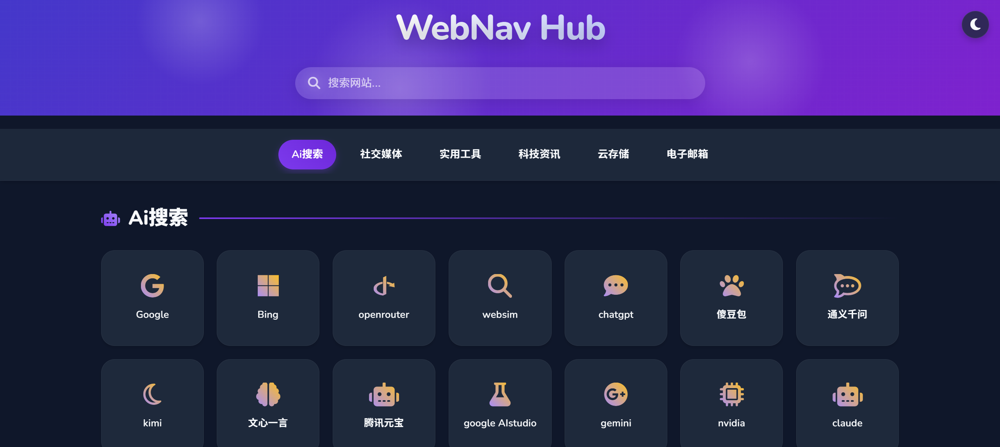

# WebNav Hub


一个优雅的网站导航中心，帮助您快速访问常用网站。采用现代化设计，支持响应式布局，提供流畅的用户体验。

## ✨ 特性

- 🎨 **现代化UI设计** - 紫色主题，优雅的卡片布局和流畅的动画效果
- 📱 **完全响应式** - 在任何设备上都能获得出色的浏览体验
- 🔍 **分类导航** - 网站按类别整齐组织，方便快速查找
- 🌙 **深色模式** - 默认深色主题，保护您的眼睛
- ⚡ **轻量级** - 无需框架，纯HTML、CSS和JavaScript构建
- 🚀 **快速加载** - 优化的资源加载，确保快速的页面渲染

## 🖥️ 预览



## 🚀 部署指南

### 通过 Cloudflare Pages 部署

1. Fork 这个仓库到您的 GitHub 账户
2. 登录 [Cloudflare Dashboard](https://dash.cloudflare.com/)
3. 进入 Pages 部分并点击 "创建项目"
4. 选择 "连接到 Git"，然后授权并选择您的仓库
5. 在构建设置中，保持默认设置即可（无需构建命令）
6. 点击 "保存并部署"

几分钟后，您的网站将在 `https://your-project-name.pages.dev` 上线。

### 通过 GitHub Pages 部署

1. Fork 这个仓库到您的 GitHub 账户
2. 进入仓库设置 (Settings)
3. 导航到 Pages 部分
4. 在 "Source" 下拉菜单中选择 "main" 分支和 "/ (root)" 文件夹
5. 点击 "Save"

您的网站将在 `https://your-username.github.io/your-repo-name` 上线。

## 🔧 自定义

### 添加新网站

编辑 `index.html` 文件，在相应的分类部分添加新的卡片：

```html
<div class="link-card">
  <a href="https://your-website-url.com" target="_blank"></a>
  <i class="fa-brands fa-icon-name"></i>
  <h3>网站名称</h3>
</div>
```

### 修改颜色主题

在 CSS 变量部分修改颜色值：

```css
:root {
  --primary-color: #8b5cf6; /* 紫色主题 */
  --primary-light: #c4b5fd;
  --primary-dark: #7c3aed;
  /* 其他颜色变量 */
}
```

### 添加新分类

在主内容区添加新的分类部分：

```html
<h2 class="category-title" id="your-category-id">
  <i class="fa-solid fa-your-icon"></i> 分类名称
</h2>
<section class="link-grid">
  <!-- 网站卡片 -->
</section>
```

同时在导航栏添加对应链接：

```html
<li>
  <a href="#your-category-id"><i class="fa-solid fa-your-icon"></i> 分类名称</a>
</li>
```

## 📝 许可证

本项目采用 [MIT 许可证](LICENSE)。

## 🙏 致谢

- [Font Awesome](https://fontawesome.com/) - 提供精美图标
- [Google Fonts](https://fonts.google.com/) - 提供优质字体
- [GitHub](https://github.com/) - 代码托管
- [Cloudflare](https://www.cloudflare.com/) - 网站部署和CDN服务

## 🔗 相关项目

- [原始项目](https://github.com/bbylw/p) - 本项目的灵感来源

---

<p align="center">Made with ❤️ by <a href="https://github.com/yourusername">Your Name</a></p>

> 本项目由 V0 进行优化修改完成。
